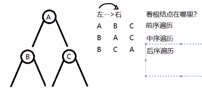

## 参考链接：

1.[C/C++数据结构知识教程：二叉树详解！详细阐述二叉树基本概念、二叉树遍历实现以及非递归遍历实现等等（干货满满）](https://www.bilibili.com/video/BV15a4y1a7B5?from=search&seid=14363068873581291478&spm_id_from=333.337.0.0)

1.空的二叉树：就是结构体的指针， tree=NULL

2.只有根节点的二叉树

3.只有左子树或者右子树二叉树

4.左右子树都存在

- 4.1完全二叉树：除了最后一个节点之外，所有节点都是满的

（下面这个不是完全二叉树，是因为最外层的最后一个节点前有空节点）

- 4.2满二叉树：除了叶子节点之外（叶子节点：最外层的节点），所有的节点都是满的

为什么要求要用完全二叉树？

因为完全二叉树，我们在给节点编序号的时候是连续的，并且序号是从1开始而不是从0开始的。

为什么二叉树序号从1开始？

这是因为子节点除以2，再向下取整等于父节点的序号

单一个体的写法，是通过结构体实现的：

二叉树遍历的方式有哪些？

【要点】：看根结点在哪里。

举例：前序遍历/中序遍历/后序遍历的结果

