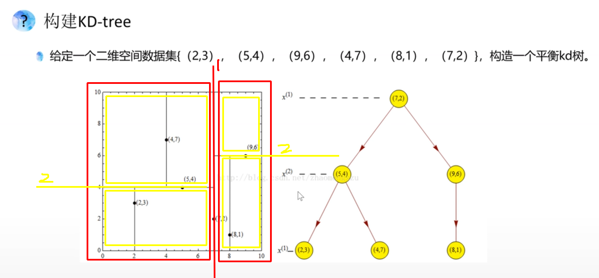

# KD_Tree

## 参考链接：

1.[学生视频-KD树--讲的很好，推荐，但是没有程序编写部分](https://www.bilibili.com/video/BV1d5411w7f5/?spm_id_from=333.788.recommend_more_video.0)

2.[Kd-tree原理与实现(有C++程序)](https://blog.csdn.net/guoziqing506/article/details/54692392)

## 什么是kd树

- kd树（K-dimension tree）是一种对k维空间中的实例点进行存储以便对其进行快速检索的树形数据结构。
- kd树是一种二叉树，表示对k维空间的一个划分，构造kd树相当于不断地用垂直于坐标轴的超平面将k维空间切分，构成一系列的k维超矩形区域，kd树的每个结点对应于一个k维超矩形区域。
- 利用kd树可以省去对大部分数据点的搜索，从而减少搜索的计算量。

## 构建kd树

1.先对维度1：进行从小到大的排序，找到中位数，若总共是奇数个，则把中位数作为切分点（作为根节点），若是偶数个，则取左边或右边作为切分点，下例是把右边的作为切分点（作为根节点。）

2.在对维度2：对左右两侧（红框）分别进行从小大的排序，找到中位数，仿照步骤1进行切分。

3.再对维度1进行切分，进行重复操作。

## 搜索kd树

## 思考：

### 1.如果排序后某一维度的值有相等怎么办？

答：先选其中一个吧
